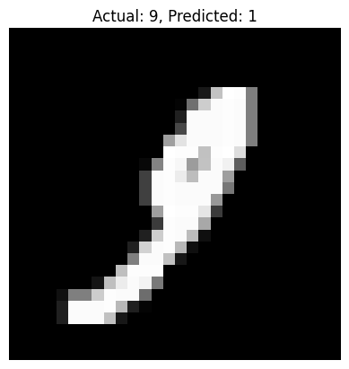
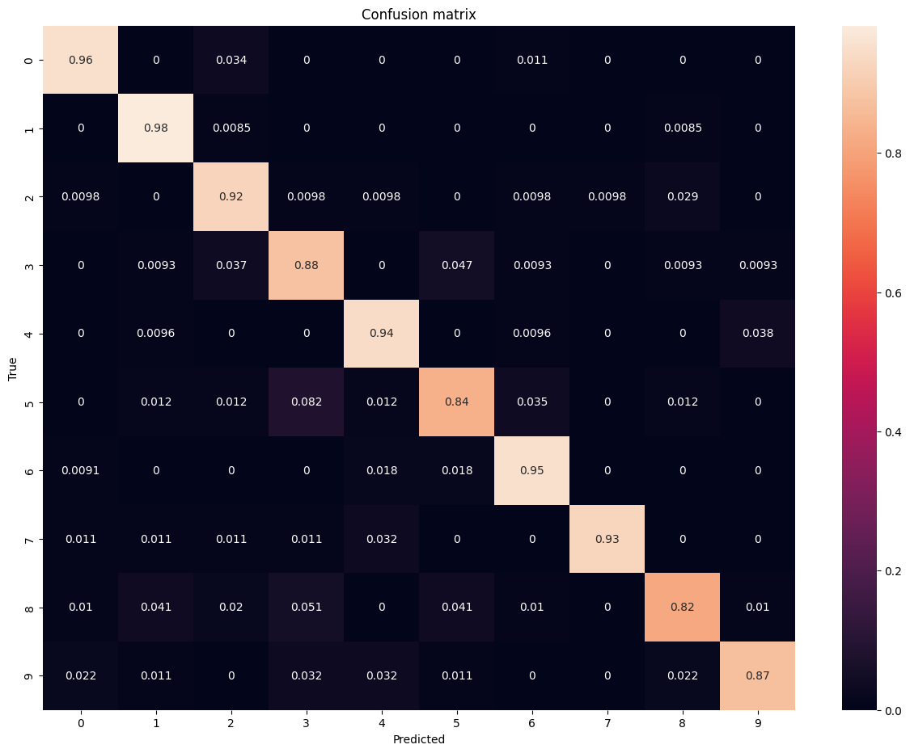

# Mnist-MSA
Model stealing attack on a neural network trained on the Mnist dataset.

### Example of model incorrectly labeling an image

   

### Target Model Heatmap

#### Accuracy: 93%
   

### Shadow Model Heatmap

#### Accuracy: 91%